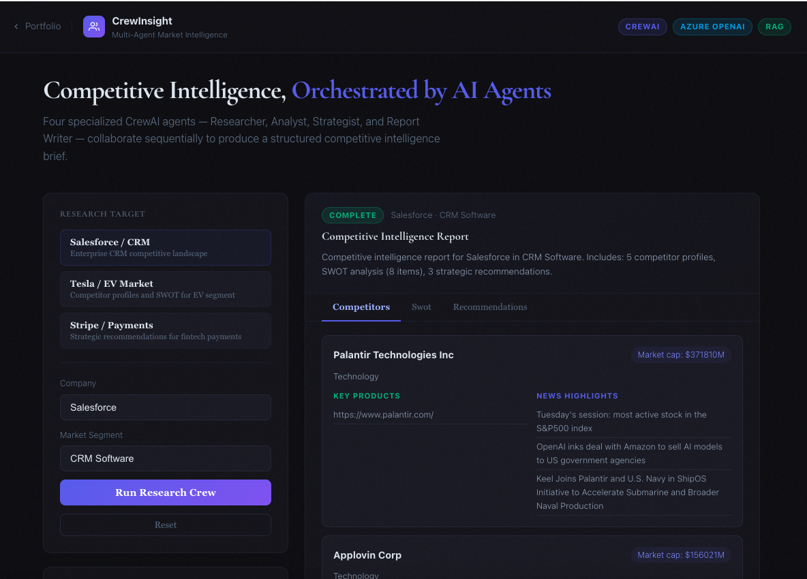
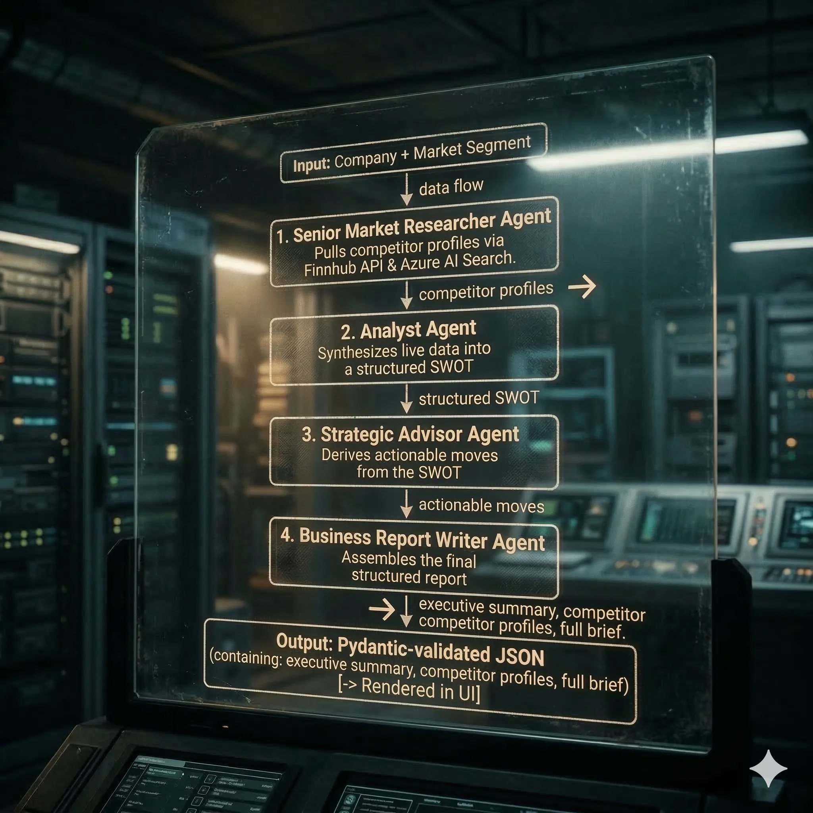

# CrewInsight — Competitive Intelligence, Orchestrated by AI Agents

[](LICENSE)
[](https://www.python.org/)
[](https://github.com/joaomdmoura/crewAI)
[](https://azure.microsoft.com/)

> **Live demo:** [crew-insight.theaiguru.dev](https://crew-insight.theaiguru.dev)
> Built by [Venky Krishnaswamy](https://theaiguru.dev)

---



---

## What It Does

You type in a company name and a market segment. CrewInsight dispatches four specialized AI agents that work sequentially — each one handing enriched context to the next — and delivers a structured competitive intelligence brief in seconds.

The output includes real competitor profiles pulled from live financial data, a SWOT analysis, strategic recommendations, and an executive summary — all ready to share or export.

Try it with **Salesforce / CRM**, **Stripe / Payments**, or any company and market you care about.

---

## How the Agents Work



Each agent's intermediate output is surfaced in the UI so you can follow the reasoning at every step.

The Four AI Agents are:
 - Senior Market Researcher Agent 
 - Competitive Intelligence Analyst Agent
 - Strategic Business Advisor Agent
 - Business Report Writer Agent


---

## Key Features

- **Multi-agent orchestration** — four specialized CrewAI agents with explicit context passing via a `Process.sequential` pipeline
- **Live financial data** — Finnhub API integration for real-time competitor profiles, market cap, and news headlines
- **Azure AI Search RAG** — retrieval-augmented generation grounded in an indexed knowledge base
- **Typed report schema** — Pydantic models enforce structure across executive summary, competitor profiles, SWOT, recommendations, and metadata
- **Streaming agent status** — the frontend shows which agent is active in real time via Server-Sent Events
- **Production telemetry** — OpenTelemetry callbacks feed Azure Application Insights; a `/metrics` endpoint exposes Prometheus-style counters
- **Distributed rate limiting** — per-IP and global daily limits backed by Azure Table Storage, enforced consistently across all replicas
- **Fully deployed on Azure** — Container Apps, Azure OpenAI, Azure AI Search, Table Storage, Log Analytics, and Application Insights provisioned via Bicep IaC with GitHub Actions CI/CD

---

## Tech Stack

| Layer | Technology |
|---|---|
| Agent Framework | [CrewAI](https://github.com/joaomdmoura/crewAI) |
| API | FastAPI + Server-Sent Events |
| LLM | Azure OpenAI (GPT-4o) |
| Market Data | Finnhub API |
| Search / RAG | Azure AI Search |
| Rate Limiting | Azure Table Storage (distributed, replica-safe) |
| Data Validation | Pydantic v2 |
| Observability | OpenTelemetry → Azure Application Insights |
| Infrastructure | Azure Container Apps, Bicep IaC |
| CI/CD | GitHub Actions |
| Frontend | React + Vite |

---

## Running Locally

```bash
git clone https://github.com/venkrishy/crewaimarketintelligence
cd crewaimarketintelligence

# Install dependencies
uv pip install -e .

# Configure environment
cp .env.example .env
# Edit .env with your credentials (see below)

# Start the API
uvicorn crewinsight.api.main:app --reload
```

The API will be available at `http://localhost:8000`. The interactive docs are at `http://localhost:8000/docs`.

### Environment Variables

```bash
# Azure OpenAI
AZURE_OPENAI_ENDPOINT=https://<your-resource>.openai.azure.com/
AZURE_OPENAI_API_KEY=<key>
AZURE_OPENAI_DEPLOYMENT=gpt-4o

# Azure AI Search
AZURE_SEARCH_ENDPOINT=https://<your-resource>.search.windows.net
AZURE_SEARCH_KEY=<key>
AZURE_SEARCH_INDEX=<index-name>

# Finnhub (optional — enables live financial data)
FINNHUB_API_KEY=<key>

# Azure Table Storage (rate limiting — required in production, optional locally)
AZURE_STORAGE_ACCOUNT_NAME=<storage-account-name>
AZURE_STORAGE_ACCOUNT_KEY=<storage-account-key>

# Rate limits (optional — defaults shown)
RATE_LIMIT_PER_IP=5/hour        # requests per IP per hour
RATE_LIMIT_GLOBAL_DAILY=50      # total requests per day across all users

# Azure Application Insights (optional — enables telemetry)
APPLICATIONINSIGHTS_CONNECTION_STRING=<connection-string>
```

---

## Rate Limits

The `POST /api/v1/research` endpoint is protected by two independent limits, both enforced via **Azure Table Storage** — shared state across all container replicas.

| Limit | Default | Scope | Resets |
|---|---|---|---|
| Per-IP | 5 requests | Per IP address | Top of each UTC hour |
| Global daily | 50 requests | All users combined | Midnight UTC |

When either limit is exceeded the API returns `HTTP 429` with a human-readable message.

**Why Table Storage?** In-process counters reset on every pod restart and diverge across replicas when the Container App scales out. Table Storage provides a single shared counter at near-zero cost (~$0.00036 per 10K operations — effectively free at 50 requests/day).

**Degradation behavior**: if Table Storage is unreachable, both limits pass through rather than blocking all traffic. The API stays available at the cost of temporarily unenforced limits.

**Overriding limits at runtime** (no redeploy needed):

```bash
az containerapp update -n crewinsight-prod-app -g rg-riskscout \
    --set-env-vars "RATE_LIMIT_PER_IP=10/hour" "RATE_LIMIT_GLOBAL_DAILY=100"
```

The per-IP format follows `<count>/hour` — only the count is used; the window is always one UTC hour.

---

## API

```
POST /research
  Body: { "company": "Salesforce", "segment": "CRM" }
  Returns: CrewReport (JSON)

GET  /research/{run_id}/stream
  Returns: Server-Sent Events stream of agent progress

GET  /metrics
  Returns: Prometheus-compatible metrics
```

---

## Project Structure

```
src/crewinsight/
├── api/
│   ├── main.py          # FastAPI app, startup, middleware
│   └── routes.py        # /research, /status, /report, /metrics endpoints
├── crew/
│   ├── process.py       # Agent classes and CrewCoordinator orchestrator
│   └── tools.py         # ResearchToolset, FormatterTool
├── data_sources/
│   └── finnhub.py       # Finnhub API client
├── models/
│   └── report.py        # Pydantic schemas: CrewReport, CompetitorProfile, etc.
├── rate_limit/
│   ├── __init__.py      # exports AzureTableStore, TableRateLimiter
│   ├── store.py         # Azure Table Storage client (atomic increment, ETag retry)
│   └── limiter.py       # Per-IP + global-daily rate limit logic
├── azure_clients.py     # Azure AI Search client
├── config.py            # Settings loaded from environment
└── telemetry.py         # OpenTelemetry + Application Insights integration
```

---

## Related Work

This project is part of a series of production-ready agentic systems I have built and deployed on Azure:

- **[riskscout](https://github.com/venkykrishnaswamy/riskscout)** — financial risk analysis agent, also deployed on Azure Container Apps, sharing the same FastAPI + telemetry + Bicep deployment patterns

Both projects demonstrate end-to-end multi-agent orchestration, observability, and automated cloud deployment — not just prototypes, but systems running in production.

---

## License

[MIT](LICENSE) — free to use, fork, and build on.
Copyright (c) 2026 Venky Krishnaswamy
